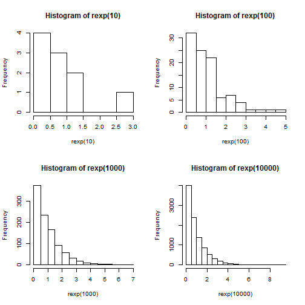
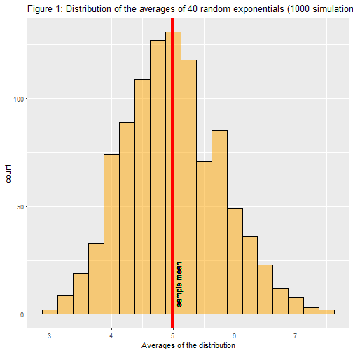
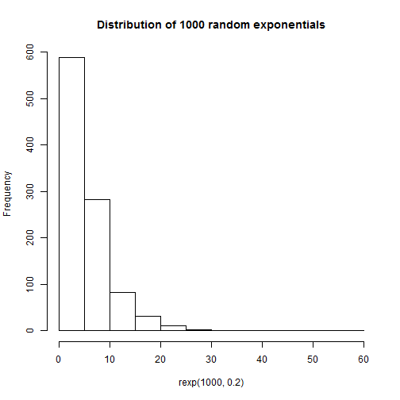
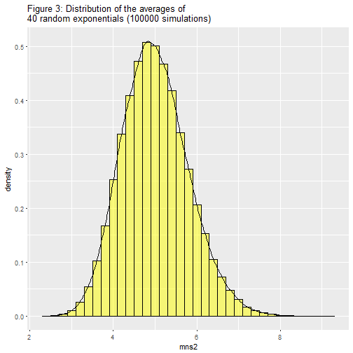
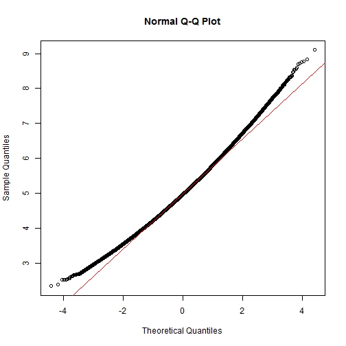

       
#                                         **Analysis By Abas Mohamed**
                                     
                                     
      
      
      
      
      
      
      
      
      
                                     

# Overview

In this project, the exponential distribution using R will be investigated. The distribution of averages of 40 exponentials will be investigated with a large number of simulations to understand the Central Limit Theorem. The code for generating random exponential distribution in R is **rexp(n,lamda)** where n refers to the sample size and lambda is the rate parameter. The mean of exponential distribution is 1/lambda and the standard deviation is also 1/lambda. In our exercise, lambda is set to 0.2 for all the simulations.

let's see how an exponential distribution looks like. The seed is set so that the results are reproducible when someone verifies the code. The random samples are drawn from exponential distribution generated using rexp(n) with the sample size (n) ranging from 10,100,1000,10000 and 100000

## Looking at Data
Let's start first loading the data.


```r
set.seed(1)
par(mfrow=c(2,2))
set.seed(1)
hist(rexp(10))
hist(rexp(100))
hist(rexp(1000))
hist(rexp(10000))
```



## Distribution of averages of 40 exponentials


```r
set.seed(1)
mns=NULL
for (i in 1 : 1000) mns = c(mns, mean(rexp(40,0.2)))
data1 <- data.frame(mns,size=40)
```

## Sample Mean versus Theoretical Mean


```r
samplemean <- mean(data1$mns)
samplemean
```

```
## [1] 4.990025
```


```r
library(ggplot2)

ggplot(data1,aes(x=mns)) + 
geom_histogram(binwidth = .25,col="black",fill="orange",alpha=.5) +
xlab("Averages of the distribution") +
ggtitle("Figure 1: Distribution of the averages of 40 random exponentials (1000 simulations)")+
geom_vline(xintercept = mean(mns),colour="red",size=2) +
geom_text(aes(x=mean(mns),label="\nsample mean",y=14),colour="black",angle=90)
```




```r
theoreticalMean <- 1/0.2
```

## Sample Variance versus Theoretical Variance


```r
sampleVariance <- var(mns)
```


```r
theoreticalVariance <- ((1/0.2)/sqrt(40))^2
```

The standard deviation of the exponential distribution is 1/lambda. The variance is calculated using the standard deviation and sample size. therfor, the theoretical variance is 0.625.


3) Hypothesis Test for Tooth Growth Comparison. we explore the effect of supplement type on tooth growth by performing a two-sample t-test with confidence level of 95% and unequal variances. And The sample variance of 0.6111165 is close to the theoretcal variance of 0.625.


## Normal Distribution

 In this section We visualize the difference between the distribution of a large collection of random exponentials and the distribution of 40 exponentials.
 
 
# Distribution of 1000 random exponentials


```r
hist(rexp(1000,0.2), main= "Distribution of 1000 random exponentials")
```



## In addition, I have shown the distribution of averages of 40 random eponentials with 100,000 simulations, this clearly approximates to the normal distribution as the Central Limit Theorem says the more sample size we have the closer we obtain a perfect bell shaped curve.


```r
set.seed(1)
mns2=NULL
for (i in 1 : 100000) mns2 = c(mns2, mean(rexp(40,0.2)))

data2 <- data.frame(mns2,size=40)
```


```r
ggplot(data2, aes(x=mns2, y=..density..)) + 
geom_histogram(col="black", fill="yellow", alpha=.5, binwidth = .20) + geom_line(stat = "density") +
ggtitle("Figure 3: Distribution of the averages of \n40 random exponentials (100000 simulations)")
```



Another way we can show that the distribution is approximately normal using qqnorm function 
 it can be assured that the sampling distribution follows the normal distribution
 
 

```r
qqnorm(data2$mns); qqline(data2$mns,col="red")
```



We conclude that the Central Limit Theorem  states that the distribution of averages of independent and identically distributed (IID) variables becomes that of a standard normal as the sample size increases.
